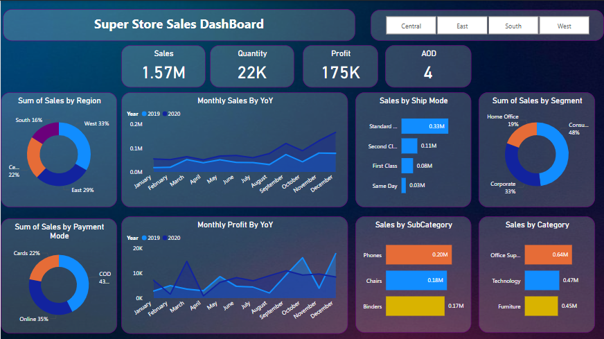

# Super Store Sales Dashboard

This repository presents a complete Power BI dashboard project analyzing Super Store sales data. It includes the Power BI report file, source dataset, and a snapshot of the final dashboard.

---

## 📁 Repository Contents

| File Name                      | Description                                      |
|-------------------------------|--------------------------------------------------|
| `SuperSales Report.pbix`      | Power BI dashboard file                          |
| `SuperStore_Sales_Dataset.csv`| Cleaned and structured dataset used in the dashboard |
| `SuperStore.png`              | Image preview of the final dashboard             |

---

## 📊 Dashboard Overview

The **Super Store Sales Dashboard** provides insights into sales performance, customer segmentation, and product analytics through interactive visuals.

### Key Metrics:
- **Sales:** 1.57M  
- **Quantity Sold:** 22K  
- **Profit:** 175K  
- **Average Order Duration (AOD):** 4

---

## 🔍 Dashboard Breakdown

### Sales by Region:
- West: 33%  
- East: 29%  
- Central: 22%  
- South: 16%

### Sales by Segment:
- Consumer: 48%  
- Corporate: 33%  
- Home Office: 19%

### Sales by Payment Mode:
- COD: 43%  
- Online: 25%  
- Cards: 22%

### Sales by Ship Mode:
- Standard Class: 0.30M  
- Second Class: 0.11M  
- First Class: 0.08M  
- Same Day: 0.03M

### Sales by Sub-Category:
- Phones: 0.20M  
- Chairs: 0.18M  
- Binders: 0.17M

### Sales by Category:
- Office Supplies: 0.64M  
- Technology: 0.47M  
- Furniture: 0.45M

### Monthly Sales & Profit (YoY):
- Trends for 2019 and 2020 visualized with line graphs

---

## 📌 Use Cases

- Executive-level performance reviews  
- Region-wise and category-wise business decisions  
- Identifying sales patterns and product demand  
- Marketing strategy refinement based on segment insights

---

